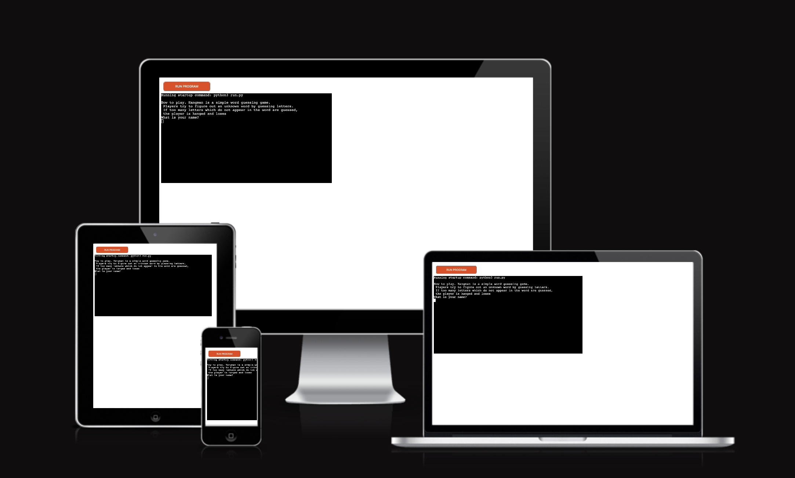
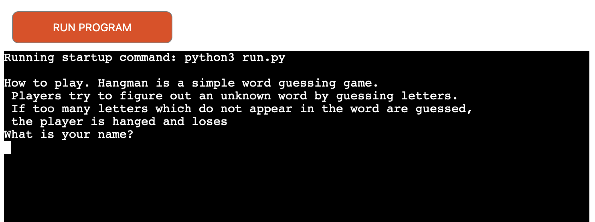
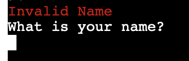
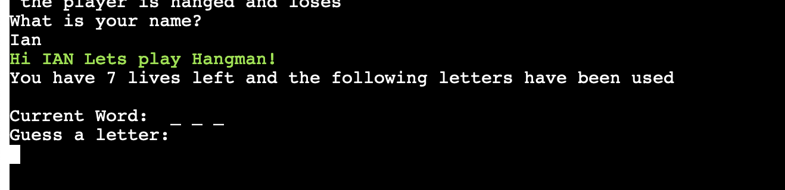
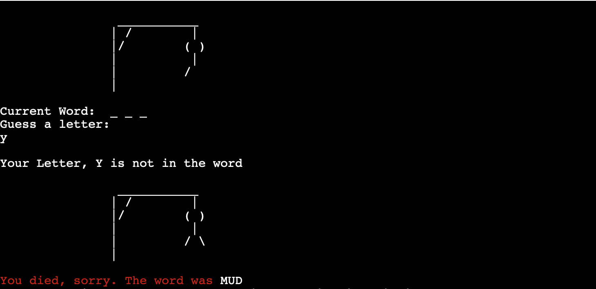
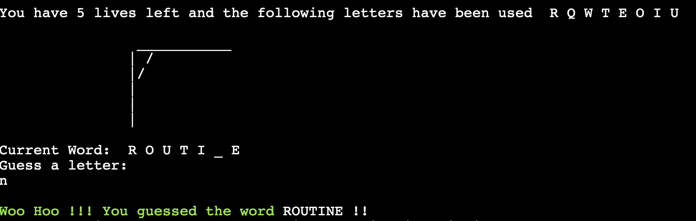
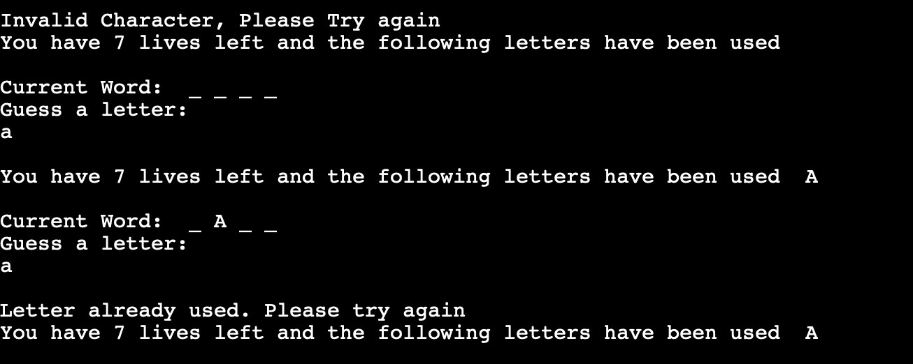
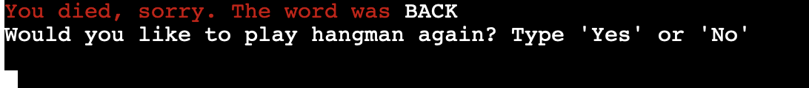

# Hangman #

This is an application built using python which allows the user play a game of Hangman. The user has 7 lives to guess the word correctly.



## UX/UI ##

   * This is an application run over a python terminal with easy to follow instructions to get started. 

## Features ##

 * Navigation

    * Once the game begins the user is given a breakdown on how to play the game and is prpmpted to enter their name

    * If the user uses a non alpha character they recevie the below message,



    * If the user enters a valid name they will see the below,

    * Once the game begins the copmputer will pick a random word from a list of 50 seen in the word.py file. the user will then be able to guess the correct letters. The user will be allowed 7 incorrect answers . Each incorrect answer will add an element to the hangman illustration . If the player looses the familiar hangman illustration will complete along with a messagecrevealing the word.
    
      If the user wins the will see the below message.
  
    * The users lives are kept track off during the game.
    * If the user enters a non alpha value or repeat a previous guess the game will not accept the answer and will ask them to guess again. 

    * Once the game finishes the user will be given the option to restart the game


 
# Testing #

   * This site works in different browsers, Chrome , Safari & Firefox

   **Firefox**


   **Chrome**


   **Safari**


   * The site is responsive and reacts well to different screen sizes.
   * I confirmed that the navigational links work, are easy to understand and all content text is readable.
   * I confirmed the form does work, each box must be filled otherwise the form will not submit. Also the email field must show a valid email or the form will not send.

**Bugs** 

*Solved Problems*

   * The background in the about us section caused the about us header to become unreadable. Creating a darker backgrouynd solved this
   * On a smaller screen a bit white space formed between the about us section and the main video banner. This was becasue I had a height define for the video and removing this fixed it. 
   * The text in the about us section lost its bullet points on smaller screens. Converting a pixel margin setting to em solved this.

**Validator Testing**

* HTML
   * No errors were retuned when passing through the official W3C validator

```
https://validator.w3.org/nu/?doc=https%3A%2F%2Foconnorian3.github.io%2Fallthingsspace%2Fyourimages.html
```
```
https://validator.w3.org/nu/?doc=https%3A%2F%2Foconnorian3.github.io%2Fallthingsspace%2Fcontactus.html
```
```
https://validator.w3.org/nu/?doc=https%3A%2F%2Foconnorian3.github.io%2Fallthingsspace%2Findex.html
```

* CSS
   * No errors were retuned when passing through the official (Jigsaw) validator

```
https://jigsaw.w3.org/css-validator/validator?uri=https%3A%2F%2Foconnorian3.github.io%2Fallthingsspace%2Fassets%2Fcss%2Fstyle.css&profile=css3svg&usermedium=all&warning=1&vextwarning=&lang=en
```
    
* Accessibility
   * The colours and fonts are easy to read by passing it through the lighthouse in dev tools.

     

# Deployment #

**The site was deployed to GitHub pages. The steps to deploy are as follows:**
   * In the GitHub repository, navigate to the Settings tab
   * From the source section drop-down menu, select the Master Branch
   * Once the master branch has been selected, the page will be automatically refreshed with a detailed ribbon display to indicate the successful deployment.

   * The live link can be found here - https://oconnorian3.github.io/allthingsspace

# Credits #

**Content** 
   * The main code for the social media links was taken from the I love running project.

**Media**

   * The video and all images was taken from pexels.com
